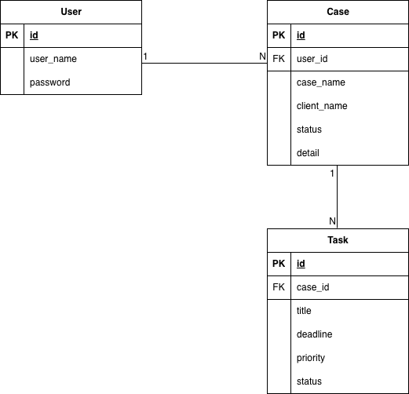

# Case Manager

## 概要
Case Manager は、社内向けの案件・タスク管理を目的とした業務管理ツールです。  
ユーザー・案件・タスクを一元管理し、担当者やステータスごとの進捗を把握可能にします。

実際の社内業務を想定  
- 権限・担当者管理  
- ステータス管理  
- 一覧検索・絞り込み検索  

を重視して設計しています。

---

## 主な機能

### ユーザー管理
- ユーザー登録
- ユーザー編集
- ユーザー削除

### 案件管理
- 案件登録・編集・削除
- 担当ユーザーの割り当て
- ステータス管理
- 案件詳細表示

### タスク管理
- タスク登録・編集・削除
- 案件に紐づくタスク管理
- 期限・優先度・ステータス管理

### 検索機能
- 一覧表示
- ステータスによる絞り込み
- 担当者による絞り込み

---

## 使用技術

| 分類 | 技術 |
|---|---|
| 言語 | Java |
| フレームワーク | Spring Boot |
| ORM | MyBatis |
| DB | MySQL |
| テンプレートエンジン | Thymeleaf |
| フロント | HTML / CSS |
| 開発環境 | IntelliJ IDEA / VSCode |
| バージョン管理 | Git / GitHub |

---

## ディレクトリ構成

```text
src/main/java/com/example/casemanager
├── controller
├── service
├── repository
├── entity
└── mapper

src/main/resources
├── templates
│   ├── user
│   ├── case
│   └── task
├── static
└── application.yml
```
---

## データベース設計

### Userテーブル
- id
- user_name
- password

### Caseテーブル
- id
- user_id
- case_name
- client_name
- status
- detail

### Taskテーブル
- id
- case_id
- title
- deadline
- priority
- status

---

## ER図



## 開発のポイント

- Controller / Service / Repository を明確に分離
- ビジネスロジックは Service 層に集約
- MyBatis を使用し SQL を明示的に管理
- 実務を想定したステータス管理設計

## 今後の拡張予定

- Spring Security による認証・認可
- ロール管理（管理者 / 一般ユーザー）
- ステータス変更履歴の管理
